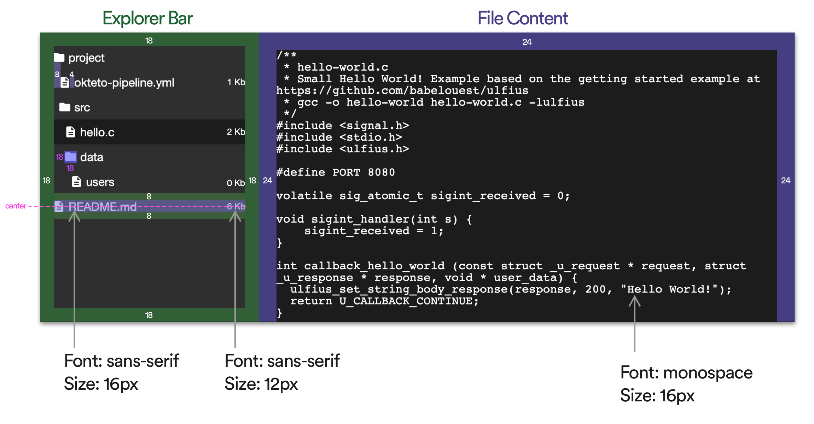
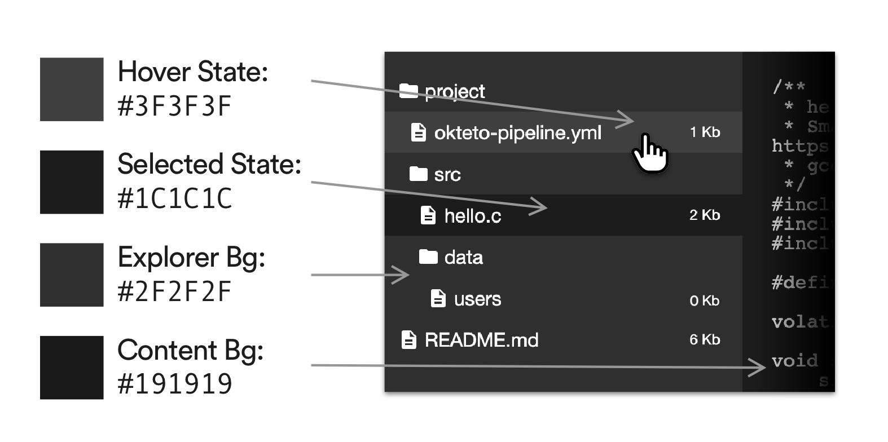

# Okteto File Manager App

[](https://cloud.okteto.com/deploy)

## API Specification

```yaml
openapi: 3.0.0
info:
  title: Files API
paths:
  "/api/files":
    get:
      summary: Get list of files
      responses:
        '200':
          description: OK
          content:
            application/json:
              schema:
                type: array
                items:
                  "$ref": /schema/file-item
```

```yaml
"$schema": https://json-schema.org/draft/2019-09/schema
"$id": /schema/file-item
title: File Item
type: object
properties:
  id:
    type: number
  name:
    type: string
  kind:
    type: string
  size:
    type: number # File size in bytes.
  parentId:
    type:
    - number
    - 'null'
  content:
    type:
    - string
    - 'null'
```

## UI Specification

### Layout



### Colors




